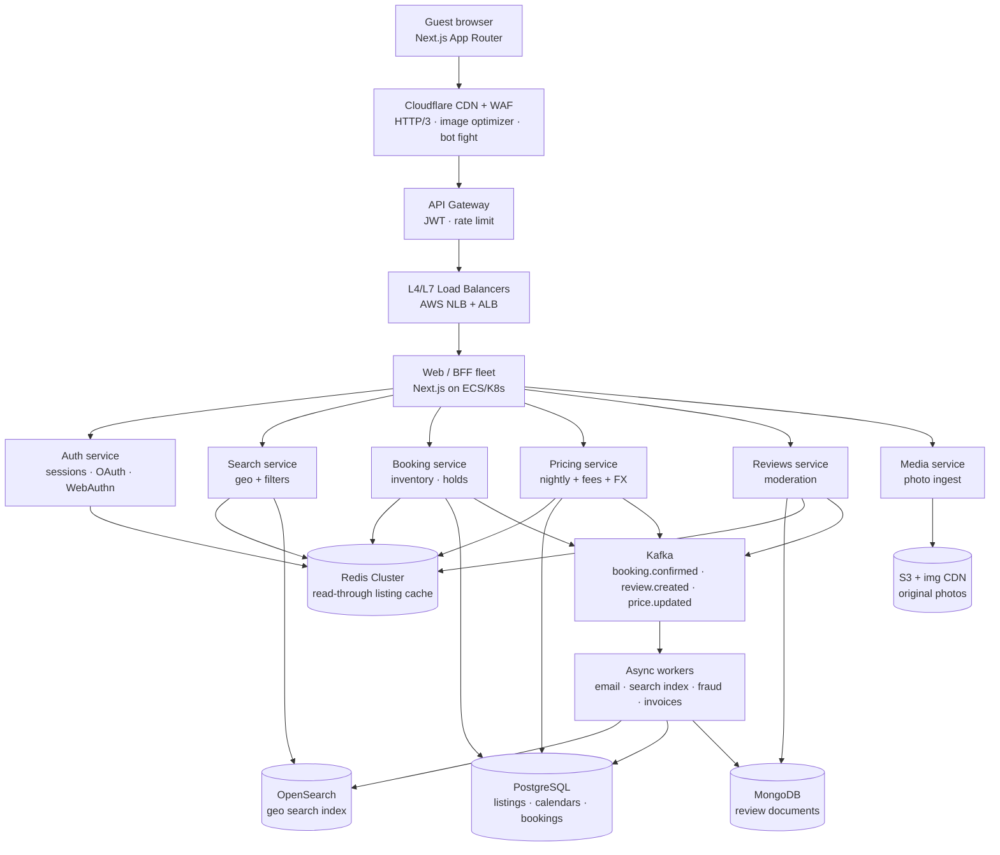

# Production architecture — vacation-rental marketplace

The live Next.js app in this repo implements the **client + BFF teaching slice**:
React Query (SWR) → Route Handler → repository → Redis → PostgreSQL.
The diagram below is the production topology that slice is modelled on.

## Deployment strategy (per node)

| Node | How it scales | How it deploys |
| --- | --- | --- |
| Cloudflare CDN | Anycast POPs; cache HIT ratio is the SLO | Terraform cache rules; purge by tag on release |
| API Gateway | Horizontal; per-route rate limits | Canary 5% → 25% → 100%; schema lint in CI |
| Load balancers | Multi-AZ; connection draining 30s | Infra-as-code; no app deploys |
| Next.js BFF | HPA on p99 TTFB; min 3 / AZ | Rolling + ISR revalidation; images via `next/image` |
| Auth | CPU-bound JWT/WebAuthn; Redis session | Blue/green; key rotation runbook |
| Search | Read replicas of OpenSearch | Index blue/green; Kafka CDC lag alert |
| Booking | Vertically isolated; Postgres is the bottleneck | Feature flags; dual-write calendar holds |
| Pricing | Aggressive Redis; compute-heavy | Autoscale on quote QPS |
| Redis | Cluster, 3 shards × 1 replica | Failover < 10s; never durable bookings |
| Kafka | Partition by aggregate id | Compacted topics for price; 7-day retention for mail |
| PostgreSQL | Partition calendars by month; Citus at 50M rows | PITR, follow-the-sun replicas |
| MongoDB | Shard reviews by `listingId` | TTL on moderation drafts |
| Workers | Consumer groups; idempotency keys | KEDA scale on lag |

## Mapping to this repository

Every box above has a working counterpart here. The shapes are honest even
though the scale is not — the same seams exist, so replacing a node means
swapping one file rather than restructuring the app.

| Production | Implemented here |
| --- | --- |
| API Gateway / BFF | `src/app/api/**/route.ts` — Route Handlers |
| Request validation at the edge | `src/server/http/validation.ts` (zod) |
| Redis Cluster | `src/server/cache/redis.ts` — ioredis / Upstash REST behind `RedisLike` |
| PostgreSQL (listings, calendar) | Prisma models in `prisma/schema.prisma` |
| MongoDB (reviews) | `reviews` table, cached separately with a longer TTL |
| Booking service transaction | `PrismaBookingRepository.create` — Serializable + GiST exclusion |
| Pricing service | `src/lib/pricing.ts`, re-evaluated server-side on every write |
| CDN `stale-while-revalidate` | `Cache-Control` on each GET route |
| Client-side SWR | React Query `staleTime` / `gcTime` |
| Optimistic UI | `useToggleSaved` heart mutation |
| Health / metrics endpoint | `GET /api/health` with live cache hit ratio |

### What is deliberately missing

Naming the gaps matters as much as filling them; each of these is a service
boundary, not a missing function.

- **Auth.** No sessions or ownership checks — every request is anonymous, so
  `POST /api/bookings` would need an authenticated principal before it could
  charge anyone. The wishlist is one row per listing for the same reason.
- **Kafka.** Confirmation email, calendar sync, and search reindex are the
  async consumers in the diagram. Here the booking write is fully synchronous.
- **Payments.** The quote is computed and stored; no authorization is taken,
  which is why a booking is `confirmed` the moment it is written.
